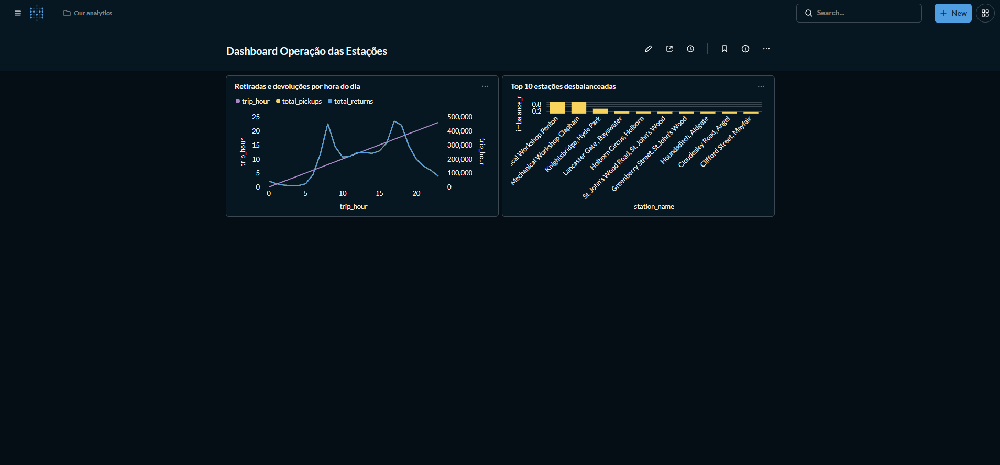
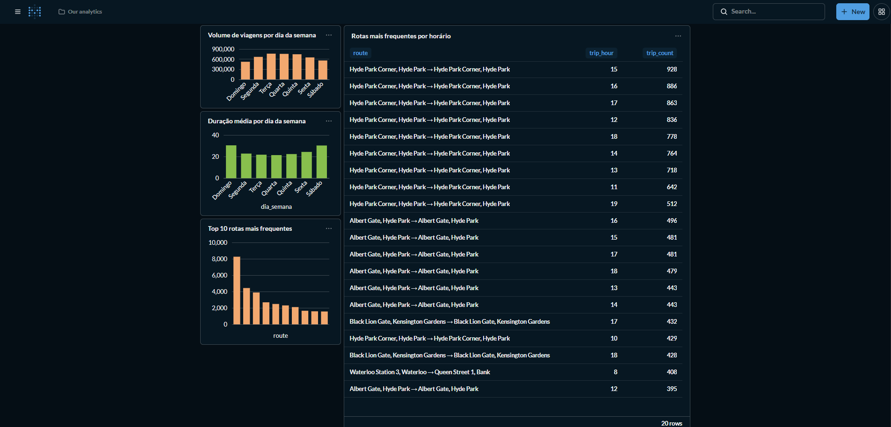
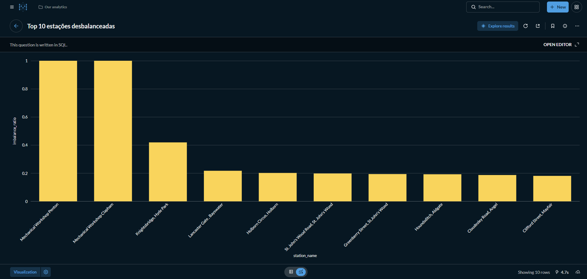
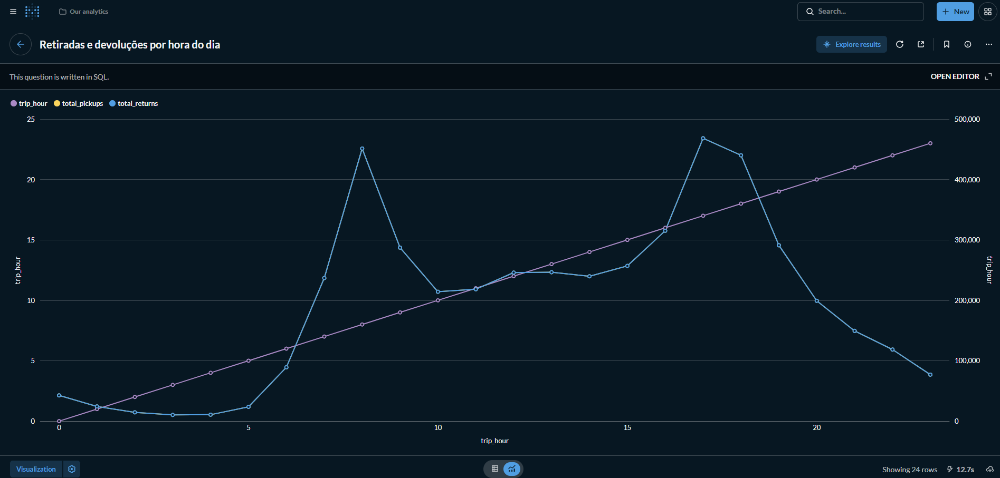

# Projeto Final — Pipeline de Dados com DBT, PostgreSQL e Great Expectations

## Descrição

Este projeto tem como objetivo a construção de um pipeline completo de dados utilizando boas práticas de Engenharia de Dados, com foco em:

- Ingestão de dados (EL)
- Validação de qualidade
- Transformação em camadas (raw, silver, gold)
- Modelagem dimensional
- Testes automatizados
- Documentação de dados

O dataset utilizado é o da **Transport for London (TfL)**, contendo **dados reais de viagens individuais de bicicletas compartilhadas**.

## Problema de Negócio

O sistema de bicicletas compartilhadas Santander Cycles, operado pela Transport for London (TfL), enfrenta um problema operacional recorrente: o desbalanceamento de bicicletas entre estações.

Durante horários de pico, algumas estações ficam completamente vazias, impedindo novas retiradas, enquanto outras ficam saturadas, impossibilitando devoluções. Esse cenário gera insatisfação dos usuários, redução do uso do sistema e necessidade constante de redistribuição manual de bicicletas.

Diante disso, este projeto busca transformar dados brutos de viagens em inteligência analítica para apoiar decisões operacionais e estratégicas.

## Perguntas de Negócio

O projeto foi desenvolvido para responder às seguintes perguntas:

- Quais estações têm maior volume de retiradas e devoluções por hora do dia?
- Quais rotas (origem → destino) são mais frequentes e em quais períodos?
- Existem estações cronicamente desbalanceadas — com muito mais retirada do que devolução?
- Como a duração média das viagens varia por dia da semana?
- Quais estações têm baixo uso e poderiam ser realocadas?

## Arquitetura do Projeto

O pipeline segue o padrão de arquitetura em camadas:

- **Raw** → Dados brutos carregados diretamente do dataset
- **Silver** → Dados tratados, padronizados e limpos
- **Gold** → Modelo analítico estruturado (fato + dimensões)

```bash
CSV → Python → PostgreSQL (raw) → dbt (silver → gold) → Metabase
```

## Tecnologias Utilizadas
- Python
- Docker
- PostgreSQL
- DBT (dbt-core + dbt-postgres)
- Great Expectations
- Apache Airflow
- Metabase
- Pandas
- SQLAlchemy

## Estrutura do Projeto

```bash
projeto-final-mobilidade/
├── data/
├── scripts/
│   ├── 01_download_bronze.py
│   ├── 02_prepare_data.py
│   ├── 03_load_raw_postgres.py
│   ├── setup_ge_project.py
│   └── run_ge_checkpoint.py
├── dbt/
│   └── mobility_dbt/
│       ├── models/
│       │   ├── silver/
│       │   └── gold/
│       ├── macros/
│       └── dbt_project.yml
├── great_expectations/
├── airflow/
├── docker-compose.yml
```

## Etapas do Pipeline

### Ingestão de Dados (Raw)

Os dados são baixados automaticamente a partir do dataset público da TfL e carregados no PostgreSQL.

Scripts utilizados:

- `01_download_bronze.py` → download dos arquivos CSV
- `02_prepare_data.py` → tratamento inicial e consolidação
- `03_load_raw_postgres.py` → carga no banco

Tabela gerada:

```text
raw.raw_cycle_trips
```

## Validação de Dados (Great Expectations)

Foi implementada validação de qualidade na camada raw utilizando Great Expectations.

Principais validações:

- Verificação de valores nulos
- Tipos de dados consistentes
- Integridade de colunas essenciais

Execução:
```bash
python scripts/run_ge_checkpoint.py
```

## Transformação com DBT (Silver)

Na camada silver, os dados são tratados e padronizados:

- Conversão de tipos (datas, números)
- Padronização de nomes de colunas
- Criação de colunas derivadas:
  - `trip_date`
  - `trip_hour`
  - `day_of_week`
- Remoção de registros inconsistentes (ex: viagens com fim antes do início)

Tabela gerada:

```text
silver.stg_cycle_trips
```

## Modelagem Dimensional (Gold)

A camada gold foi modelada utilizando o padrão estrela.

### Dimensões

- `dim_station` → informações das estações
- `dim_date` → informações de calendário

### Tabela fato

- `fact_trip` → viagens realizadas


## Surrogate Keys

Foram utilizadas chaves substitutas (surrogate keys) para garantir integridade e performance no modelo dimensional.

As chaves foram geradas utilizando macros do dbt (`dbt_utils.generate_surrogate_key`) nas seguintes tabelas:

- `dim_station`
- `dim_date`
- `fact_trip`

Isso permite:

- evitar dependência de chaves naturais
- melhorar performance de joins
- garantir consistência do modelo estrela


## Macro Customizada

Foi criada uma macro no dbt para classificar a duração das viagens:

```sql
{{ duration_bucket('trip_duration_minutes') }}
```
Classificação:

short → viagens curtas
medium → viagens médias
long → viagens longas

Essa classificação é utilizada na tabela fato para análises comportamentais.


## Testes com DBT

Foram implementados testes automatizados para garantir a qualidade dos dados.

### Testes genéricos

- `not_null`
- `unique`
- `accepted_values`

### Testes singulares

- Nenhuma viagem com duração negativa
- Nenhuma viagem com data de fim anterior à data de início

Após tratamento na camada silver, todos os testes passaram com sucesso.

## Dashboards

Os dados da camada gold foram utilizados para construção de dashboards no Metabase.

### Dashboard 1 — Operação das Estações

- Volume de retiradas e devoluções por hora
- Estações mais desbalanceadas
- Estações com baixo uso

### Dashboard 2 — Rotas e Comportamento

- Rotas mais frequentes
- Rotas por horário
- Duração média das viagens por dia da semana

## Principais Insights

A partir das análises realizadas, foi possível identificar:

- Picos de uso concentrados nos horários de deslocamento (manhã e final da tarde)
- Rotas recorrentes entre determinadas estações, indicando padrões de mobilidade
- Estações com forte desbalanceamento, exigindo redistribuição de bicicletas
- Viagens mais longas durante finais de semana, sugerindo uso recreativo
- Estações com baixo volume de uso, candidatas à realocação


## Storytelling do Projeto

O sistema de bicicletas compartilhadas Santander Cycles, operado pela Transport for London (TfL), possui centenas de estações distribuídas pela cidade de Londres.

Apesar da ampla cobertura, o sistema enfrenta um problema operacional crítico: o desbalanceamento de bicicletas entre estações.

Durante horários de pico:

- algumas estações ficam completamente vazias → impossibilitando retiradas  
- outras ficam saturadas → impossibilitando devoluções  

Esse cenário gera:

- insatisfação dos usuários  
- redução da eficiência do sistema  
- necessidade constante de redistribuição manual  


## Objetivo da Solução

Este projeto transforma dados brutos de viagens em inteligência analítica para:

- identificar padrões de uso  
- detectar estações problemáticas  
- entender comportamento dos usuários  
- apoiar decisões de redistribuição  


## Diagrama de Arquitetura

```text
CSV → Python → PostgreSQL (RAW)
          ↓
Great Expectations (Qualidade)
          ↓
DBT (Silver → Gold)
          ↓
Metabase (Dashboards)
          ↑
Airflow (Orquestração)
```

## Dashboards (prints)

### Dashboard 1 — Operação das Estações



### Dashboard 2 — Rotas e Comportamento



### Gráfico — Top 10 estações desbalanceadas



### Gráfico — Retiradas e devoluções por hora do dia



## Fonte dos Dados

Dataset utilizado:

- https://cycling.data.tfl.gov.uk/

Descrição:

Dados reais do sistema Santander Cycles, contendo:

- data e hora de início e fim
- estação de origem e destino
- duração da viagem
- identificação da bicicleta

Os dados são baixados automaticamente via script:

```bash
python scripts/01_download_bronze.py
```


## Orquestração com Airflow

O pipeline foi orquestrado utilizando Apache Airflow.

A DAG executa:

- ingestão de dados
- validação com Great Expectations
- transformação com DBT
- testes automatizados

Garantindo:

- execução ordenada
- controle de dependências
- tolerância a falhas
- monitoramento do pipeline


## Como executar Airflow

```bash
docker compose up -d
```

Depois, acesse no navegador:
http://localhost:8080

Credenciais padrão:
usuário: airflow
senha: airflow


```md
## Fluxo da DAG

- `load_raw` → carrega os dados brutos no schema raw
- `validate_raw` → valida a qualidade dos dados com Great Expectations
- `dbt_run` → executa as transformações nas camadas silver e gold
- `dbt_test` → executa os testes do dbt sobre os modelos

Esse encadeamento garante a execução ordenada do pipeline, desde a ingestão até a validação final das transformações.


## Testes com DBT

Foram implementados testes automatizados:

not_null
unique
accepted_values

Resultado:

PASS=21

## Documentação

A documentação foi gerada utilizando dbt:

dbt docs generate
dbt docs serve

A interface permite visualizar:

Linhagem de dados
Modelos
Testes

## Como Executar o Projeto

### Pré-requisitos

Antes de iniciar, é necessário ter instalado:

- Docker
- Docker Compose
- Python 3.11+
- Git


### 1. Clonar o repositório

```bash
git clone https://github.com/ICChumski/Lab_FINAL.git
cd projeto-final-mobilidade
```

### 2. Subir os serviços com Docker

```bash
docker-compose up -d
```
Isso irá subir os principais serviços do ambiente, como PostgreSQL, Airflow e Metabase.


### 3. Executar o download e preparação dos dados

```bash
python scripts/01_download_bronze.py
python scripts/02_prepare_data.py
python scripts/03_load_raw_postgres.py
```

Esses scripts realizam:

- download dos arquivos do dataset da TfL
- consolidação e preparação dos dados
- carga da camada raw no PostgreSQL


### 4. Configurar e executar a validação com Great Expectations

Na primeira execução, configurar o projeto do Great Expectations:

```bash
python scripts/setup_ge_project.py
```

Depois, executar o checkpoint:

```bash
python scripts/run_ge_checkpoint.py
```

### 5. Executar as transformações com dbt

```bash
cd dbt/mobility_dbt
dbt deps
dbt run
```

### 6. Executar os testes do dbt

```bash
dbt test
```

### 7. Gerar a documentação do dbt

```bash
dbt docs generate
dbt docs serve
```

### 8. Acessar o Airflow

Com os containers em execução, acesse:

http://localhost:8080

Credenciais padrão:

usuário: airflow
senha: airflow


### 9. Acessar o Metabase

Com os containers em execução, acesse:

http://localhost:3000

No primeiro acesso, configure a conexão com o PostgreSQL utilizando:

Host: host.docker.internal
Port: 5432
Database: mobility
Username: mobility_user
Password: mobility_pass

### 10. Executar a DAG no Airflow

A DAG executa as seguintes etapas:

load_raw
validate_raw
dbt_run
dbt_test

## Resultados

O pipeline entrega:

- Dados tratados e estruturados
- Modelo dimensional pronto para BI
- Validação de qualidade automatizada
- Testes de integridade
- Documentação navegável

## Conclusão

Este projeto demonstra a construção de um pipeline moderno de dados utilizando ferramentas amplamente adotadas no mercado, aplicando conceitos essenciais como:

ELT
Data Quality
Modelagem dimensional
Data Testing
Data Documentation

## Storytelling do Projeto

O sistema de bicicletas compartilhadas Santander Cycles, operado pela Transport for London (TfL), conta com mais de 800 estações distribuídas pela cidade de Londres.

Apesar da ampla cobertura, o sistema enfrenta um problema operacional crítico: o desbalanceamento de bicicletas entre estações. Durante horários de pico, algumas estações ficam completamente vazias, impedindo retiradas, enquanto outras ficam saturadas, impossibilitando devoluções.

Esse cenário gera:

- Insatisfação dos usuários
- Redução do uso do sistema
- Ineficiência operacional
- Necessidade constante de redistribuição manual de bicicletas

Neste contexto, este projeto tem como objetivo transformar dados brutos de viagens em inteligência analítica, permitindo:

- Identificar padrões de uso
- Detectar estações desbalanceadas
- Entender comportamento dos usuários
- Apoiar decisões de rebalanceamento e expansão da rede

O pipeline desenvolvido permite processar grandes volumes de dados históricos e convertê-los em informações estratégicas para otimização do sistema.

## Perguntas de Negócio

O modelo construído permite responder perguntas estratégicas como:

- Quais estações têm maior volume de retiradas e devoluções por hora do dia?
- Quais rotas (origem → destino) são mais frequentes e em quais períodos?
- Existem estações cronicamente desbalanceadas (muito mais retirada do que devolução)?
- Como a duração média das viagens varia ao longo da semana?
- Quais estações apresentam baixo uso e poderiam ser realocadas?


## Diagrama de Arquitetura

```text
        +----------------------+
        | TfL Cycling Dataset  |
        | (Trips CSVs)         |
        +----------+-----------+
                   |
                   v
        +----------------------+
        | Python (Ingestão)    |
        +----------+-----------+
                   |
                   v
        +----------------------+
        | PostgreSQL (RAW)     |
        +----------+-----------+
                   |
                   v
        +----------------------+
        | Great Expectations   |
        | (Validação)          |
        +----------+-----------+
                   |
                   v
        +----------------------+
        | DBT (Silver)         |
        | Transformação        |
        +----------+-----------+
                   |
                   v
        +----------------------+
        | DBT (Gold)           |
        | Modelo Estrela       |
        +----------+-----------+
                   |
                   v
        +----------------------+
        | Metabase / BI        |
        +----------------------+
                   ^
                   |
        +----------------------+
        | Airflow (Orquestração)|
        +----------------------+
```

## Dashboards e Visualizações

Os dados modelados na camada gold estão prontos para consumo em ferramentas de BI.

Exemplos de visualizações que podem ser construídas:


## Fonte dos Dados

Dataset utilizado:

- https://cycling.data.tfl.gov.uk/

Descrição:

Dados reais do sistema Santander Cycles, contendo milhões de registros de viagens individuais, incluindo:

- Data e hora de início e fim
- Estação de origem e destino
- Duração da viagem
- Identificação da bicicleta

Os dados são disponibilizados em arquivos CSV semanais, permitindo construção de grandes volumes históricos.

## Orquestração com Airflow

O pipeline foi orquestrado utilizando Apache Airflow, garantindo a execução sequencial e controlada das etapas do processo de dados.

A DAG implementada executa as seguintes etapas:

- `load_raw` → ingestão dos dados na camada raw  
- `validate_raw` → validação de qualidade com Great Expectations  
- `dbt_run` → transformação dos dados nas camadas silver e gold  
- `dbt_test` → execução dos testes do dbt  

Isso garante:

- Execução automatizada do pipeline  
- Controle de dependências entre tarefas  
- Tolerância a falhas (retries)    
- Monitoramento da execução  